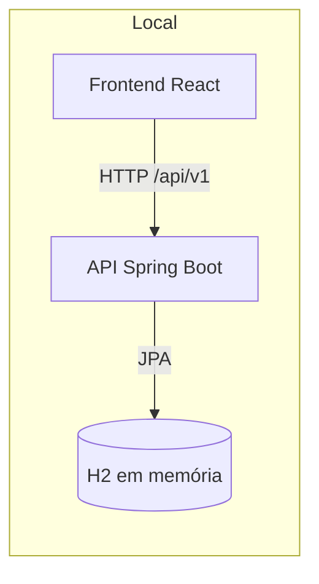

# ☁️ Do Zero à Cloud

> **Construa uma API Kanban com Spring Boot e publique tudo no Railway.**

> Esta branch é a alternativa local com H2 em memória. O deploy da semana 2 continua usando PostgreSQL no Railway.


## O workshop

Este workshop acontece em dois momentos:

| Semana | Objetivo | Resultado |
| --- | --- | --- |
| 1. Funciona localmente | Implementar a API e conectar o frontend ao H2 em memória. | Frontend → API → H2 no seu computador |
| 2. Funciona na cloud | Empacotar os serviços com Docker e publicar no Railway. | Frontend, API e banco acessíveis pela internet |



## Comece por aqui

### 1. Faça seu fork e clone

Cada grupo deve trabalhar no próprio fork. É esse repositório que será conectado ao Railway na segunda semana.

### 2. Banco local pronto

Não é necessário instalar ou configurar um banco local: o backend usa H2 em memória. Os dados são apagados sempre que a API é reiniciada.

### 3. Suba o backend

Em um terminal:

```bash
cd backend
./mvnw spring-boot:run
```

A API ficará disponível em `http://localhost:8090/api/v1`. O Hibernate cria as tabelas automaticamente no banco vazio.

### 4. Suba o frontend apontando para a API local

Em outro terminal:

```bash
cd frontend
npm install
npm run dev
```

Abra `http://localhost:5173`.

### 5. Siga os checkpoints

No frontend, acesse **Configurações → Auditoria da API**. A tela prepara dados temporários, mostra cada requisição e libera o próximo checkpoint somente depois da aprovação do anterior.

| Checkpoint | O que implementar | Conceitos |
| --- | --- | --- |
| 1. Board | `GET /board` no controller | rota, resposta JSON e service |
| 2. Column | controller e service para criar/listar colunas | path variable, regra de negócio e repository |
| 3. Task | mapeamentos, entidade, repository, service e controller | JPA, persistência e fluxo vertical completo |

O caminho de cada funcionalidade é sempre:

```text
Frontend → Controller → Service → Repository → H2
```

## Frontend com uma API publicada

Quando o backend já estiver publicado, rode o frontend local apontando para a URL pública:

```bash
cd frontend
VITE_API_URL=https://SEU-BACKEND.up.railway.app npm run dev
```

Informe apenas a origem da API, sem `/api/v1`.

## Semana 2 — Railway (PostgreSQL)

O H2 desta branch é exclusivamente uma contingência para execução local. Para publicar no Railway, siga este roteiro com PostgreSQL.

Crie um projeto no Railway e adicione três serviços: **PostgreSQL**, **backend** e **frontend**.

### Backend

1. Crie um serviço a partir do seu repositório GitHub.
2. Configure **Root Directory** como `/backend`.
3. Configure **Config File Path** como `/backend/railway.toml`.
4. Adicione as variáveis:

```text
DB_URL=jdbc:postgresql://${{Postgres.PGHOST}}:${{Postgres.PGPORT}}/${{Postgres.PGDATABASE}}
DB_USERNAME=${{Postgres.PGUSER}}
DB_PASSWORD=${{Postgres.PGPASSWORD}}
```

5. Gere um domínio público para o serviço.

O health check usa `/actuator/health`.

### Frontend

1. Crie outro serviço a partir do mesmo repositório.
2. Configure **Root Directory** como `/frontend`.
3. Configure **Config File Path** como `/frontend/railway.toml`.
4. Defina a variável:

```text
VITE_API_URL=https://${{backend.RAILWAY_PUBLIC_DOMAIN}}
```

5. Gere o domínio público do frontend.

O container lê `VITE_API_URL` quando inicia. Assim, a URL do backend pode mudar sem gerar uma nova imagem do frontend.

## Estrutura

```text
.
├── backend/     # API Spring Boot e exercícios
├── frontend/    # Interface React e auditoria guiada
└── README.md    # guia principal do workshop
```

## Tecnologias

Java 17 · Spring Boot · Spring Data JPA · H2 (local) · PostgreSQL (Railway) · React · TypeScript · Docker · Railway
